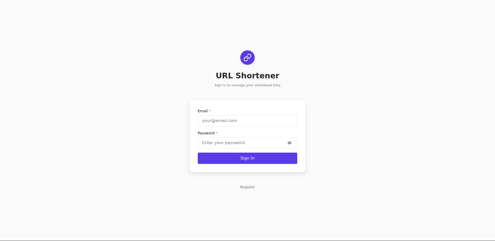
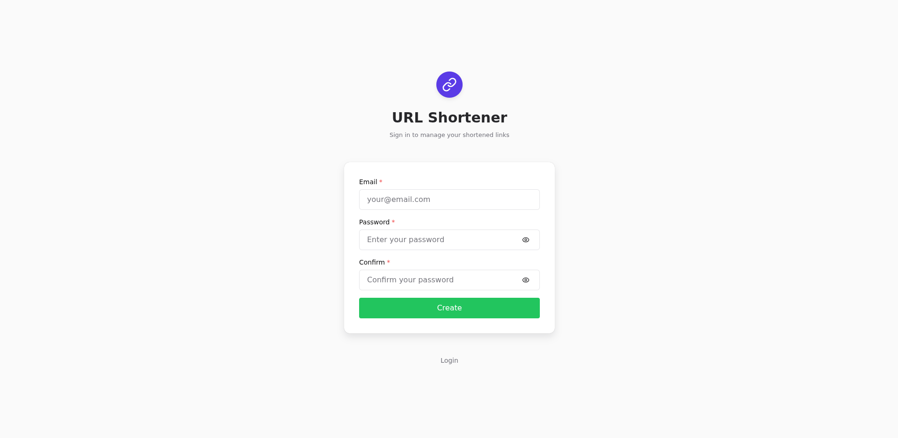
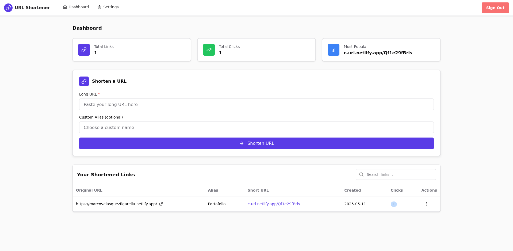
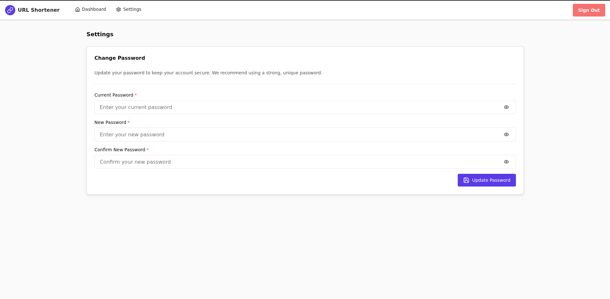

# 🔗 LinkShortener App


A modern link shortener web application with analytics dashboard — built for users and recruiters to demonstrate technical skills in a real-world project.

> ⚡ Powered by React, TypeScript, Chakra UI, Zustand, Zod, and Firebase.

---

## 🧭 Table of Contents

* [Features](#features)
* [Screenshots](#screenshots)
* [Tech Stack](#tech-stack)
* [Live Demo](#live-demo)
* [Installation](#installation)
* [Project Structure](#project-structure)
* [Future Improvements](#future-improvements)
* [License](#license)
* [Contact](#contact)

---

## ✨ Features

* User registration and login using Firebase Auth
* Analytics dashboard:

  * Total links created
  * Total clicks
  * Most clicked link
* Form to create short links with custom aliases
* List of all created links:

  * Original URL
  * Alias
  * Generated short URL
  * Creation date
  * Click count
  * Copy to clipboard
  * Delete option
* Settings page to update password

---

## 🖼️ Screenshots

> Replace these with your actual app screenshots.

* 
* 
* 
* 

---

## 🛠️ Tech Stack

* **Vite** – Fast bundler
* **React + TypeScript** – Core framework with strong typing
* **React Router** – Navigation between pages
* **React Hook Form** – Lightweight form management
* **Zod** – Schema validation
* **Zustand** – Simple and efficient global state management
* **Firebase** – Auth and storage backend
* **Chakra UI** – Accessible and customizable component library

---

## 🌐 Live Demo

Try the deployed app 👉 [Live Demo](https://c-url.netlify.app/)

---

## 🚀 Installation

```bash
git clone https://github.com/Marco90v/shortUrl.git
cd shortUrl
pnpm install
pnpm run dev
```

> Make sure to configure your `.env` file with Firebase credentials.

---

## 🗂️ Project Structure (simplified)

```
src/
├── components/
├── pages/
├── services/
├── schema/
|-- store
├── utils/
|-- type.d.ts
|-- .evn
├── App.tsx
└── main.tsx
```

---

## 🧩 Future Improvements

* [ ] Pagination in links list
* [ ] Dark mode

---

## 📝 License

This project is licensed under the MIT License.

---

## 📬 Contact

* GitHub: [@Marco90v](https://github.com/Marco90v)
* LinkedIn: [https://www.linkedin.com/in/marco90v/](https://www.linkedin.com/in/marco90v/)
* Portfolio: [https://marcovelasquezfigarella.netlify.app/en/](https://marcovelasquezfigarella.netlify.app/en/)

---

Thanks for checking out this project! 🚀
