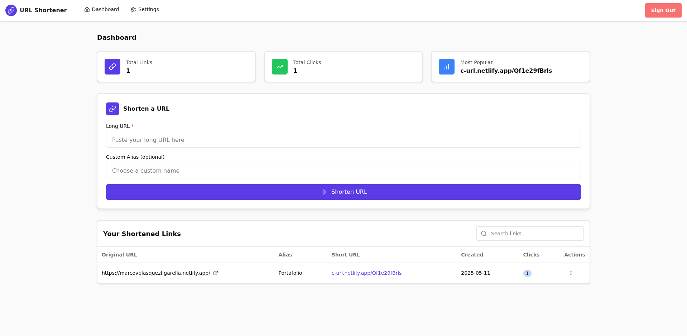
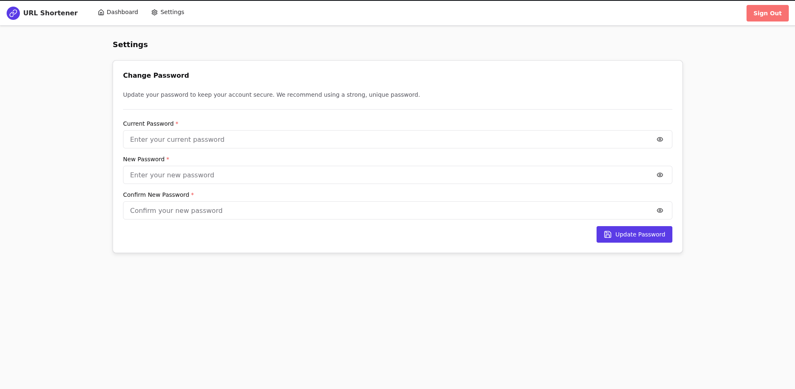

# 🔗 LinkShortener App


Una aplicación web para acortar enlaces con estadísticas avanzadas, pensada tanto para usuarios como para mostrar habilidades técnicas en tu portafolio.

> ⚡ Proyecto desarrollado con React, TypeScript, Zustand, Zod, Chakra UI y Firebase.

---

## 🧭 Tabla de Contenido

* [Características](#características)
* [Capturas de pantalla](#capturas-de-pantalla)
* [Tecnologías](#tecnologías)
* [Instalación](#instalación)
* [Estructura del Proyecto](#estructura-del-proyecto)
* [Mejoras Futuras](#mejoras-futuras)
* [Licencia](#licencia)
* [Contacto](#contacto)

---

## ✨ Características

* Registro e inicio de sesión de usuarios con Firebase Auth
* Dashboard con estadísticas de uso:

  * Total de enlaces creados
  * Total de clics
  * Enlace más popular
* Formulario para crear enlaces con alias personalizados
* Listado con todos los enlaces creados:

  * Enlace original
  * Alias
  * URL corta generada
  * Fecha de creación
  * Total de clics
  * Botón para copiar al portapapeles
  * Opción para eliminar
* Sección de configuración para cambio de contraseña

---

## 🖼️ Capturas de pantalla

> Puedes reemplazar estas imágenes cuando tengas tus propias capturas.

* 
* 
* 
* 

---

## 🛠️ Tecnologías

* **Vite** – Empaquetador rápido
* **React + TypeScript** – Librería principal y tipado
* **React Router** – Navegación entre vistas
* **React Hook Form** – Formularios eficientes
* **Zod** – Validación de formularios
* **Zustand** – Manejo de estado global simple y eficiente
* **Firebase** – Autenticación y almacenamiento
* **Chakra UI** – Componentes UI accesibles y modernos

---

## 🌐 Demo en Vivo

Prueba la aplicación desplegada aquí 👉 [Ver Demo](https://c-url.netlify.app/)

---

## 🚀 Instalación

```bash
git clone https://github.com/Marco90v/shortUrl.git
cd shortUrl
pnpm install
pnpm run dev
```

> Necesitarás configurar Firebase (auth y database) en un archivo `.env` con tus claves.

---

## 🗂️ Estructura del Proyecto (resumida)

```
src/
├── components/
├── pages/
├── services/
├── schema/
|-- store
├── utils/
|-- type.d.ts
|-- .evn
├── App.tsx
└── main.tsx
```

---

## 🧩 Mejoras Futuras

* [ ] Paginación en listado de enlaces
* [ ] Modo Oscuro

---

## 📝 Licencia

Este proyecto está bajo la licencia MIT.

---

## 📬 Contacto

* GitHub: [@Marco90v](https://github.com/Marco90v)
* LinkedIn: [https://www.linkedin.com/in/marco90v/](https://www.linkedin.com/in/marco90v/)
* Portafolio: [https://marcovelasquezfigarella.netlify.app/es/](https://marcovelasquezfigarella.netlify.app/es/)

---

¡Gracias por visitar este proyecto! 🚀
